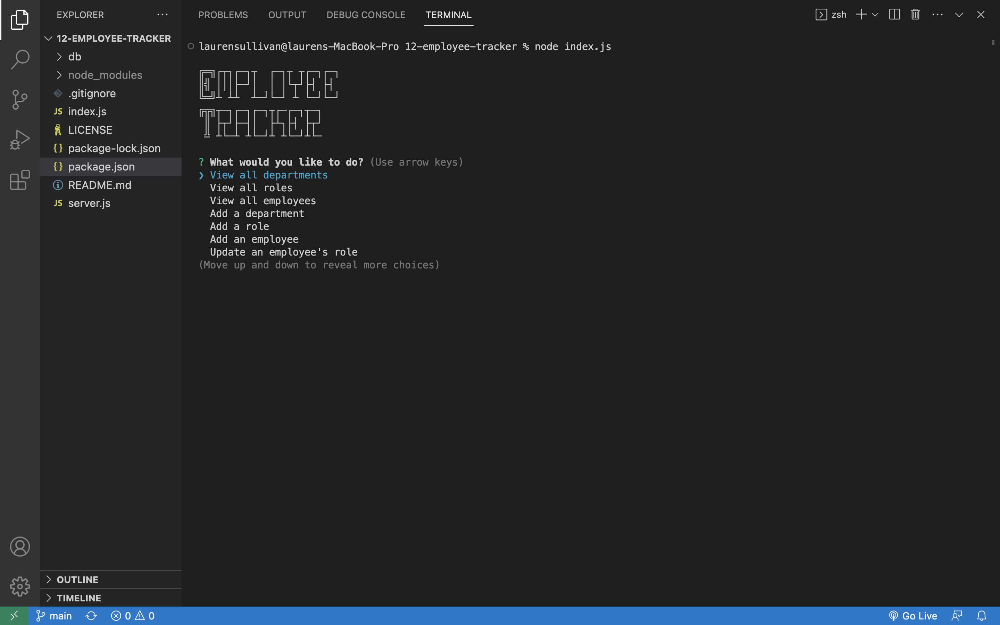

# 12-employee-tracker

## Description

Employee Tracker is a command line application that business owner can use to organize their business personnel.

## Table of Contents

- [Installation](#installation)
- [Visual](#visual)
- [Usage](#usage)
- [Contributing](#contributing)
- [License](#license)
- [Questions](#questions)

## Visual

## Usage

This application is run from the command line. Invoke the project using the command: 
    
`node index.js`

From there, you will be prompted with the application's navigation. It allows you to view or manage the departments, roles, and employees in your company, and to quit the application when you are finished. 

## Contributing

If you would like to contribute to this project, you can create a fork of this repository.

## License

    
## Questions

[My GitHub](https://github.com/lnsvn)

If you have further questions about this application, I can be reached by [e-mail](lsullivan301@yahoo.com)
